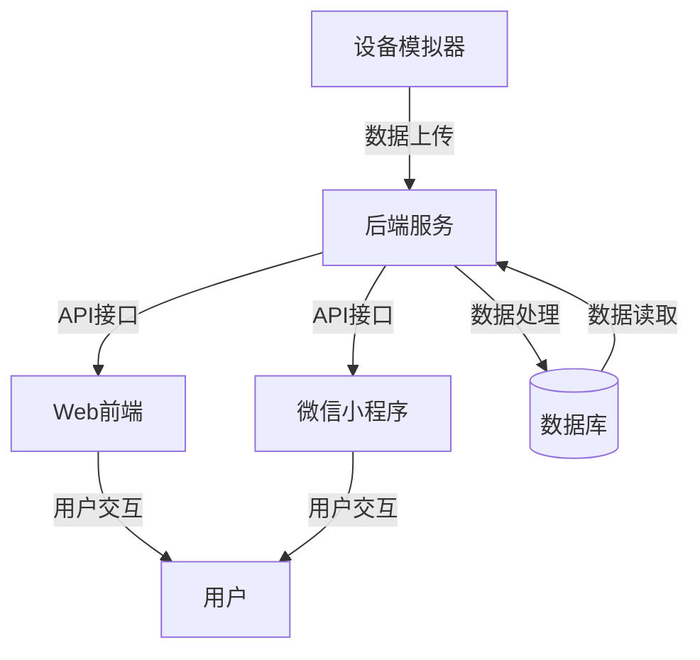

# 🌟 智能设备数据监控与分析系统 🌟

<div align="center">
  


</div>

<p align="center">
  
</p>

## ✨ 系统亮点

<table>
  <tr>
    <td width="50%">
      <h3 align="center">📱 多平台支持</h3>
      <p align="center">Web前端 + 微信小程序，随时随地访问</p>
    </td>
    <td width="50%">
      <h3 align="center">🔄 实时数据监控</h3>
      <p align="center">设备数据实时上传与监控，及时响应异常</p>
    </td>
  </tr>
  <tr>
    <td width="50%">
      <h3 align="center">📊 数据可视化</h3>
      <p align="center">基于u-charts的精美图表展示，直观了解数据趋势</p>
    </td>
    <td width="50%">
      <h3 align="center">🤖 智能分析</h3>
      <p align="center">自动分析设备数据，提供专业建议</p>
    </td>
  </tr>
</table>

## 🏗️ 系统架构



## 🔍 主要功能

<details>
<summary>💻 设备监控与管理</summary>

- 实时监控设备状态
- 远程控制设备开关
- 设备异常自动报警
- 设备数据历史记录查询

</details>

<details>
<summary>📈 数据分析与可视化</summary>

- 多维度数据展示
- 趋势分析与预测
- 自定义数据看板
- 数据报表导出功能

</details>

<details>
<summary>👥 用户管理系统</summary>

- 多级用户权限控制
- 个人信息管理
- 操作日志记录
- 消息通知系统

</details>

<details>
<summary>🔧 系统配置与维护</summary>

- 系统参数配置
- 备份与恢复
- 性能监控
- 系统日志分析

</details>

## 💎 技术栈

### 后端
- Node.js/Express
- RESTful API设计
- 中间件机制
- JWT认证

### 前端
- Vue.js框架
- Vuex状态管理
- Vue Router
- 响应式设计

### 小程序
- 微信小程序框架
- u-charts图表库
- 组件化开发
- 微信云开发

### 设备模拟器
- IoT协议支持
- 数据生成与模拟
- 网络通信模块
- 状态监控

## 🚀 快速开始

### 1️⃣ 安装依赖

```bash
# 后端依赖安装
cd backend
npm install

# 前端依赖安装
cd ../frontend
npm install

# 设备模拟器依赖安装
cd ../Device_Simulator
npm install
```

### 2️⃣ 启动系统

```bash
# 启动后端
cd backend
npm run start

# 启动前端
cd ../frontend
npm run serve

# 启动设备模拟器
cd ../Device_Simulator
npm run start
```

### 3️⃣ 小程序开发

使用微信开发者工具打开`miniprogram3`目录

## 📖 项目文档

<div align="center">
  
[API文档](./API_Documentation.md) | [系统设计文档](https://example.com) | [用户手册](https://example.com)

</div>

## 📊 项目演示

<p align="center">
  
  
  
  
</p>

## 🔮 未来计划

- [ ] 支持更多设备类型
- [ ] AI智能分析模块
- [ ] 移动应用开发
- [ ] 云端部署方案

## 👨‍💻 开发团队

<div align="center">
  
| 角色 | 负责内容 |
|------|----------|
| 后端开发 | API设计与实现、数据处理、安全机制 |
| 前端开发 | Web界面开发、交互设计、状态管理 |
| 小程序开发 | 微信小程序界面、数据展示、用户体验 |
| 设备模拟 | 模拟器开发、通信协议、数据生成 |

</div>

## 📜 协议

本项目采用 MIT 协议开源，详情请参见 [LICENSE](LICENSE) 文件。

---

<div align="center">
  <sub>软件系统架构课程项目 © 2023</sub>
</div>
